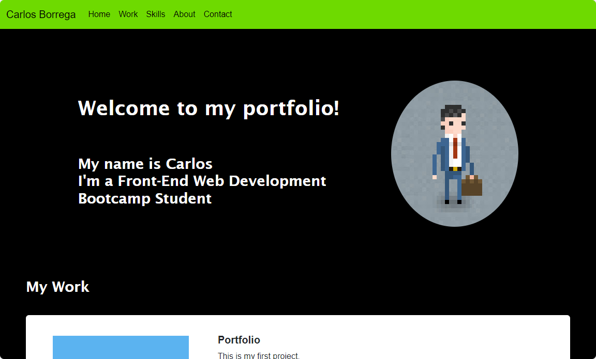

# Carlos Borrega Bootstrap Portfolio Website

## Description 

Welcome to my enhanced personal portfolio created using HTML, CSS, and Bootstrap. This portfolio is designed to showcase my skills, projects, and information in an organized and visually appealing manner.




## Deployment

The deployed version of the Carlos Borrega Portfolio Website can be accessed [here](https://borregaio.github.io/bootstrap-portfolio/).


## Key Features

1. **Bootstrap-Centric Design:** The portfolio is primarily crafted using Bootstrap, harnessing its powerful components and styles for a modern and consistent layout.

2. **Enhanced Responsiveness:** A key focus of this portfolio is its responsiveness, ensuring an optimal viewing experience across various devices, including mobile phones and tablets.

3. **Improved Design:** This portfolio represents a significant improvement over the previous version, incorporating enhanced aesthetics and user-friendly features. You can check the previous version [here](https://borregaio.github.io/special-system/).


## Installation

### Clone the repository
```console
git clone https://github.com/borregaio/bootstrap-portfolio.git
```

### Navigate to the project directory
```console
cd bootstrap-portfolio
```

### Open with VSCode
```console
code .
```

## Steps Followed to Create the Portfolio Website

1. **Navigation Bar:**
   - The portfolio features a responsive navigation bar with links that smoothly navigate to the appropriate sections within the webpage.

      ```html
         <nav class="navbar navbar-expand-lg navbar-dark">
         <div class="container-fluid">
               <a class="navbar-brand" href="#">Carlos Borrega</a>
               <button class="navbar-toggler" type="button" data-bs-toggle="collapse" data-bs-target="#navbarNav"
                  aria-controls="navbarNav" aria-expanded="false" aria-label="Toggle navigation">
                  <span class="navbar-toggler-icon"></span>
               </button>
               <div class="collapse navbar-collapse" id="navbarNav">
                  <ul class="navbar-nav">
                     <li class="nav-item">
                           <a class="nav-link active" aria-current="page" href="#">Home</a>
                     </li>
                     <li class="nav-item">
                           <a class="nav-link active" aria-current="page" href="#work">Work</a>
                     </li>
                     <li class="nav-item">
                           <a class="nav-link active" aria-current="page" href="#skills">Skills</a>
                     </li>
                     <li class="nav-item">
                           <a class="nav-link active" aria-current="page" href="#about">About</a>
                     </li>
                     <li class="nav-item">
                           <a class="nav-link active" aria-current="page" href="#footer">Contact</a>
                     </li>
                  </ul>
               </div>
         </div>
      </nav>
      ```

2. **Hero Section:**
   - A prominent jumbotron showcases my avatar, name, and additional information, creating a captivating introduction.

      ```html
         <section id="hero">
         <div class="hero-grid">
               <h1 class="hero-title">Welcome to my portfolio!</h1>
               <h3 class="hero-description">My name is Carlos<br>I'm a Front-End Web Development<br>Bootcamp Student</h3>
               
         </div>
      </section>
      ```

3. **Work Section:**
   - The work section displays my projects in a grid format using Bootstrap cards. Each card provides a concise overview of the respective project.

      ```html
                  <div class="card mb-3">
                     <div class="row g-0">
                           <div class="col-md-4">
                              
                           </div>
                           <div class="col-md-8">
                              <div class="card-body">
                                 <h5 class="card-title">Portfolio</h5>
                                 <p class="card-text">This is my first project.</p>
                                 <p class="card-text">I used HTML, CSS and Bootstrap to achieve
                                       the desired look.</p>
                                 <p class="card-text">It features a Navbar, a Hero section, my skills, my work, and a
                                       little more about me at the end.</p>
                                 <p class="card-text">You can also contact me clicking on the footer
                                       links.</p>
                              </div>
                           </div>
                     </div>
                  </div>
      ```

4. **Skills List:**
    - A dedicated section lists the skills I expect to learn from the bootcamp, providing a clear overview of my learning goals.

      ```html
      <section id="skills">
         <h3>My Skills</h3>
         <div class="container-fluid">
               <div class="row">
                  <div class="card col-sm-12 col-md-4 col-lg-4">
                     
                     <div class="card-body">
                           <h6 class="card-text">I am currently learning HTML5</h6>
                     </div>
                  </div>
                  <div class="card col-sm-12 col-md-4 col-lg-4">
                     
                     <div class="card-body">
                           <h6 class="card-text">I am also learning CSS3</h6>
                     </div>
                  </div>
                  <div class="card col-sm-12 col-md-4 col-lg-4">
                     
                     <div class="card-body">
                           <h6 class="card-text">Bootstrap too!</h6>
                     </div>
                  </div>
               </div>
         </div>
      </section>
      ```

5. **About Section:**
   - An "About Me" section provides insights into my background and interests.

      ```html
         <section id="about">
         <div class="container-fluid">
               <div class="row">
                  <div class="col-sm-12 col-md-6 col-lg-6">
                     <h3>About Me</h3>
                     <p>I am a dedicated front-end developer currently enrolled in a comprehensive bootcamp, I bring a
                           unique blend of technical expertise and strong interpersonal skills. Passionate about crafting
                           innovative applications, my focus lies in mobile
                           design. Eager to leverage my diverse skill set and relentless drive for excellence in
                           contributing to dynamic development projects. </p>
                  </div>
                  <div class="col-sm-12 col-md-6 col-lg-6">
                     
                  </div>
               </div>
         </div>
      </section>
      ```

6. **Contact/Footer:**
   - The portfolio includes a footer section for additional information or links. All hyperlinks feature a hover effect, providing a visually appealing interactive experience.

      ```html
         <footer id="footer">
         <div class="links">
               <a href="mailto:c.borrega@proton.me">Email</a>
               <a href="https://github.com/borregaio">Github</a>
               <a href="https://www.linkedin.com/in/carlosborrega/">LinkedIn</a>
         </div>
         <h6>© Carlos Borrega</h6>
      </footer>
      ```

      ```css
         #footer a:hover {
            color: var(--color2);
         }
      ```

7. **Button Styling:**
   - All buttons within the portfolio display a subtle box shadow upon hover, enhancing the overall user experience.

      ```css
      .project-button:hover {
         box-shadow: 10px 5px 5px var(--color1);
      }
      ```

8. **Responsive Design:**
   - The portfolio is designed to be responsive for various devices, including mobile, without heavy reliance on media queries. Bootstrap components contribute to a seamless and adaptable layout.

      ```css
      @media only screen and (max-width: 480px)
      ```

9. **Testing:**
   - Verified that the website maintains its visual consistency after the refactoring.